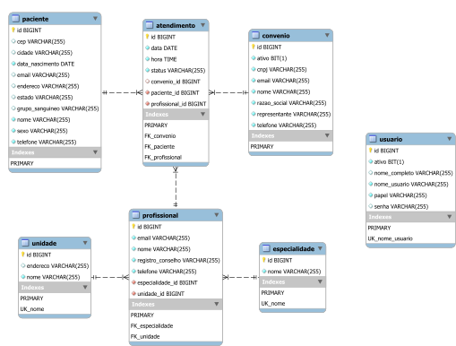

# fundamentos-back-end

Repositório da disciplina Fundamentos de Programação Back-end

> __Leituras preparatórias para a disciplina:__
>
> 1. O que é Java? (Alura): <https://www.alura.com.br/apostila-java-orientacao-objetos/o-que-e-java>
> 2. Iniciando na linguagem Java
 (DevMedia): <https://www.devmedia.com.br/iniciando-na-linguagem-java/21136>
>
> _As leituras indicadas são um pouco antigas, mas continuam sendo excelentes textos de introdução à linguagem Java. Portanto, desconsidere trechos que envolvam termos como "hoje", "atualmente", etc._

# Atualizando seu repositório local

O código produzido em sala de aula, e compartilhado neste repositório, pode ser atualizado em seu repositório local com o comando:

```console
git pull
```

No entando, se você fez alterações no seu repositório local, o comando acima pode gerar conflitos. Para evitar lidar com isso, você pode forçar uma atualização com o repositório remoto por meio dos comandos:

```console
git fetch origin
git reset --hard origin/main
```

O primeiro comando recebe as atualizações mais recentes do repositório remoto, e o segundo descarta todas as alterações locais e atualiza com o histórico mais recente do repositório remoto (branch main).

# Sites de referência

- Jakarta Server Pages Specification: <https://jakarta.ee/specifications/pages/3.1/jakarta-server-pages-spec-3.1.html>
- Jakarta Servlet Specification: <https://jakarta.ee/specifications/servlet/6.0/jakarta-servlet-spec-6.0.html>
- Apostila Java e Orientação a Objetos (Caelum/Alura): <https://www.alura.com.br/apostila-java-orientacao-objetos>
- Apostila Java para Desenvolvimento Web (Caelum/Alura): <https://www.alura.com.br/apostila-java-web>
- Baeldung: <https://www.baeldung.com/>
- Java Tutorial (VS Code): <https://code.visualstudio.com/docs/java/java-tutorial>

# Ferramentas

- __Visual Studio Code__
  - <https://code.visualstudio.com/Download>
- __Extension Pack for Java (Extensão do VS Code)__
  - <https://marketplace.visualstudio.com/items?itemName=vscjava.vscode-java-pack>
- __Java Server Pages - JSP (Extensão do VS Code)__
  - <https://marketplace.visualstudio.com/items?itemName=pthorsson.vscode-jsp>
- __XML (Extensão do VS Code)__
  - <https://marketplace.visualstudio.com/items?itemName=redhat.vscode-xml>
- __Git__
  - <https://git-scm.com/downloads>
- __JDK 17__
  - Verificar versão do JDK instalada:
    - ```javac -version```
  - <https://download.oracle.com/java/17/archive/jdk-17.0.6_windows-x64_bin.msi>
  - Criar a variável de ambiente JAVA_HOME configurada para o diretório de instalação do JDK. Exemplo: “C:\Program Files\Java\jdk-17”.
  - Adicionar “%JAVA_HOME%\bin” na variável de ambiente PATH.
  - Tutorial de configuração: <https://mkyong.com/java/how-to-set-java_home-on-windows-10/>
- __Maven__
  - Verificar versão do Maven instalada:
    - ```mvn -version```
  - <https://dlcdn.apache.org/maven/maven-3/3.9.1/binaries/apache-maven-3.9.1-bin.zip>
  - Adicionar o diretório de instalação do Maven na variável de ambiente PATH. Exemplo: “C: apache maven bin”.
  - Tutorial de instalação: <https://mkyong.com/maven/how-to-install-maven-in-windows/>
- __Apache Tomcat 10__
  - Verifique se o Tomcat está instalado e funcionando:
    - Localize o aplicativo __Monitor Tomcat__.
    - Acesse a URL __<http://localhost:8080>__, que deve exibir uma página indicando que o Tomcat está funcionando.
  - Link para download: <https://dlcdn.apache.org/tomcat/tomcat-10/v10.1.7/bin/apache-tomcat-10.1.7.exe>
  - [Tutorial de instalação](https://github.com/webacademyufac/tutoriais/blob/main/tomcat/tomcat.md)
- __MySQL__
  - Verificar se o MySQL está funcionando:
    - ```mysql -u root -p```
    - Tentar acessar com senha em branco ou senha igual ao nome de usuário (root).
    - Tutorial para resetar a senha de root: <https://dev.mysql.com/doc/mysql-windows-excerpt/8.0/en/resetting-permissions-windows.html>
  - Link para download: <https://dev.mysql.com/downloads/file/?id=516927>
  - [Tutorial de instalação](https://github.com/webacademyufac/tutoriais/blob/main/mysql/mysql.md)
  - Para criação do banco e importação de dados, a partir do diretório _sql_, executar os comandos:
    - ```mysql -u root -p < sgcm.sql```
    - ```mysql -u root -p sgcm < dados.sql```

# SGCM - Diagrama de Classes


# SGCM - Diagrama Entidade Relacionamento



# Atividades práticas

1. [INDIVIDUAL] Crie uma classe chamada "ArraysDinamicos" para demonstrar os recursos disponíveis para manipulação de arrays dinâmicos em Java, contemplando os itens relacionados abaixo. Ao final, compartilhe o arquivo fonte (.java) em uma pasta com seu nome no repositório de atividades práticas da disciplina. (Entrega: 12/04/2023)
  
    - Crie um array dinâmico de inteiros com o nome `numeros`, e valores 5, 2, 9, 7 e 1.
    - Imprima os elementos do array `numeros` utilizando um loop `for`ou `for-each`.
    - Utilize o método `sort()` da classe `java.util.Collections` para ordenar o array `numeros` em ordem crescente e imprima os elementos do array `numeros`.
    - Utilize o método `binarySearch()` da classe `java.util.Collections`
     para buscar o número 9 no array `numeros` e imprima na tela o resultado da busca.
    - Crie um novo array dinâmico de inteiros chamado `maiores`.
    - Utilize o método `subList()` para copiar os três maiores números do array `numeros` para o array `maiores`, e imprima os elementos do array `maiores`.
    - Utilize o método `equals()` para comparar os arrays `numeros` e `maiores` e imprima na tela o resultado da comparação.
    - Imprima na tela os elementos do array `numeros` em ordem decrescente.
      - _Não há apenas uma única forma de fazer isso. Pesquise sobre as soluções possíveis e escolha uma._

    __Solução:__ <https://github.com/webacademyufac/fundamentos-back-end/commit/227fec4>

2. [INDIVIDUAL] Criar classes na camada de acesso ao banco de dados (DAO) para as entidades `Especialidade` e `Unidade`, de forma semelhante à classe `ProfissionalDao`, e implementar o método `get()`. Para registro, compartilhe os fontes (.java) em uma pasta com seu nome no repositório de atividades práticas da disciplina. (Entrega: 17/04/2023)

    __Solução:__ <https://github.com/webacademyufac/fundamentos-back-end/commit/c2fafaf>

3. [INDIVIDUAL] Modificar o arquivo [_profissionais.jsp_](https://github.com/webacademyufac/fundamentos-back-end/blob/main/sgcm/src/main/webapp/profissionais.jsp), dispondo os conteúdos dos elementos HTML **_head_**, **_header_**  e **_footer_**, em arquivos separados, armazenados dentro do diretório `include`, a exemplo do que foi feito com os elementos **_nav_** e **_div#comandos_**. (Entrega: 19/04/2023)

4. [GRUPO] Construir páginas JSP (e todas as demais classes e métodos Java necessários) para cadastro de convênios, unidades, especialidades, pacientes e usuários, de forma semelhante à página de cadastro de profissionais, e baseado nos diagramas acima. (Entrega: ~24/04/2023~ 26/04/2023)

    - Na classe que representa o paciente, os atributos `grupo sanguíneo` e `sexo` devem ser de um tipo abstrato construído com a utilização de [Enums](https://docs.oracle.com/javase/tutorial/java/javaOO/enum.html).
    - Também deve ser usado [Enum](https://docs.oracle.com/javase/tutorial/java/javaOO/enum.html) para o atributo `papel` do usuário, que deverá ter ao menos duas opções: `ADMIN` e `ATENDENTE`.
    - Em relação ao cadastro de usuário, não é necessário implementar nenhum tipo de encriptação para senha. No entanto, no formulário deve ser utilizado o elemento HTML adequado ao tipo do campo.

> **IMPORTANTE:** Todos os membros dos grupos devem participar das atividades, registrando esta participação por meio da identificação dos commits com seus respectivos usuários no GitHub.
